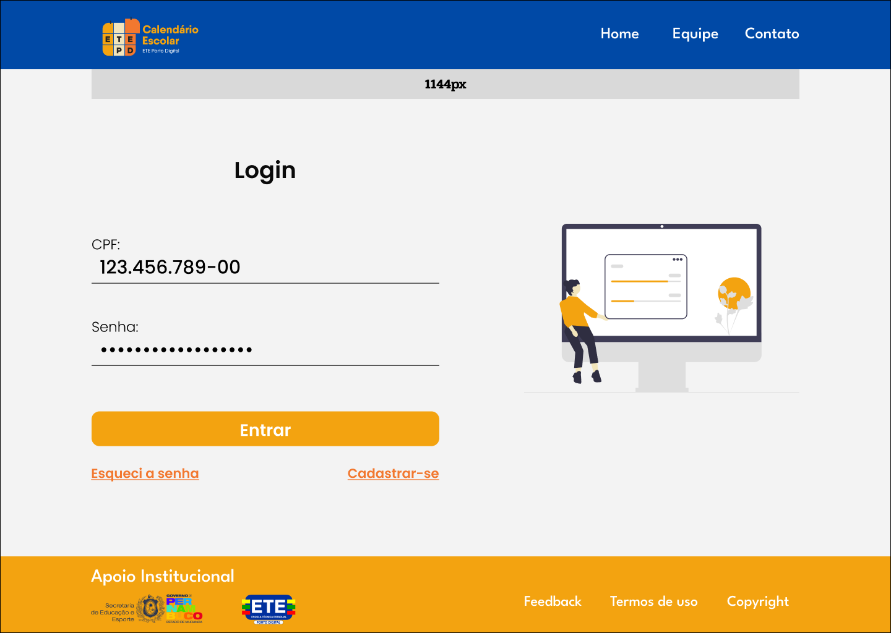
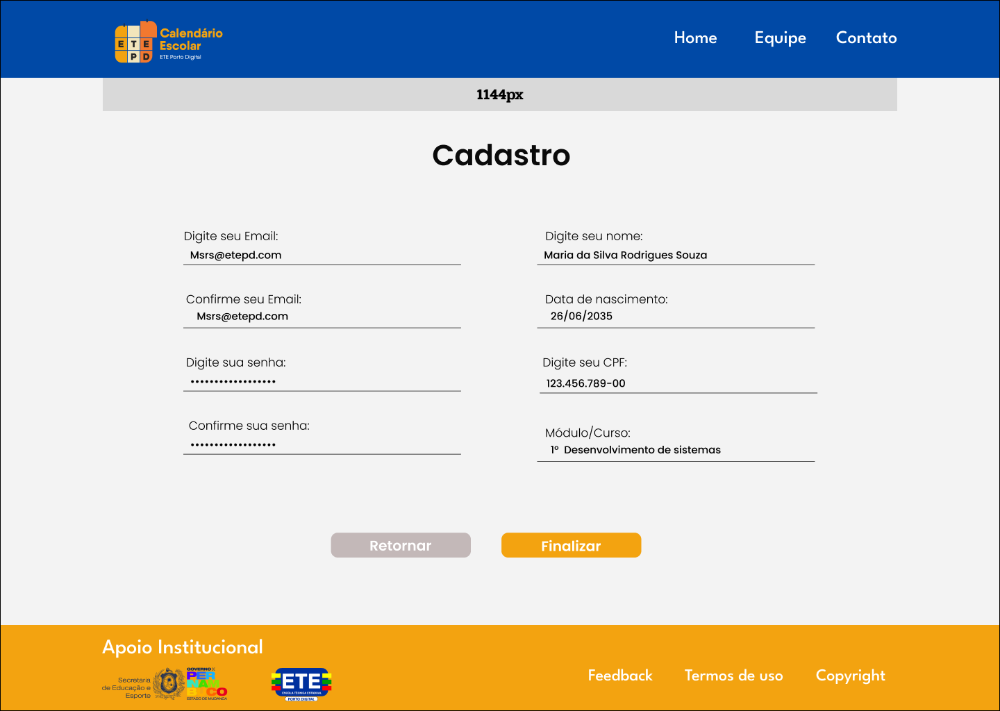
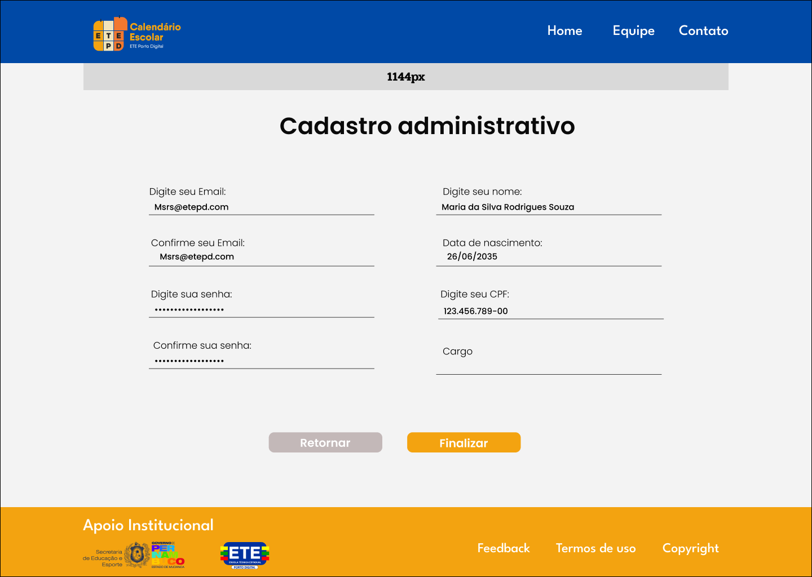
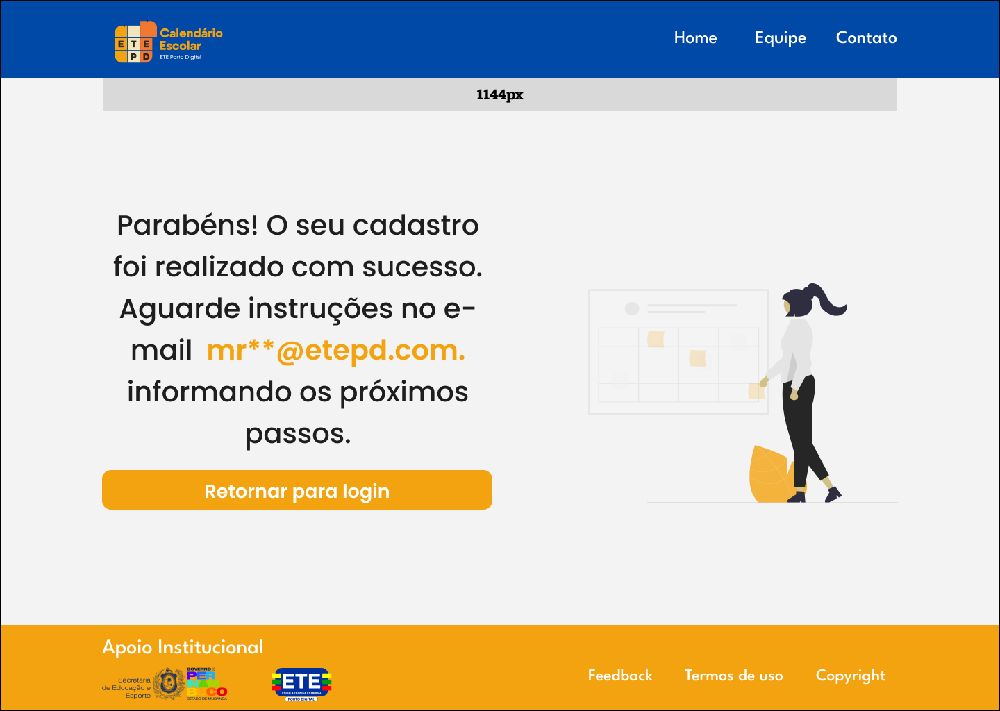
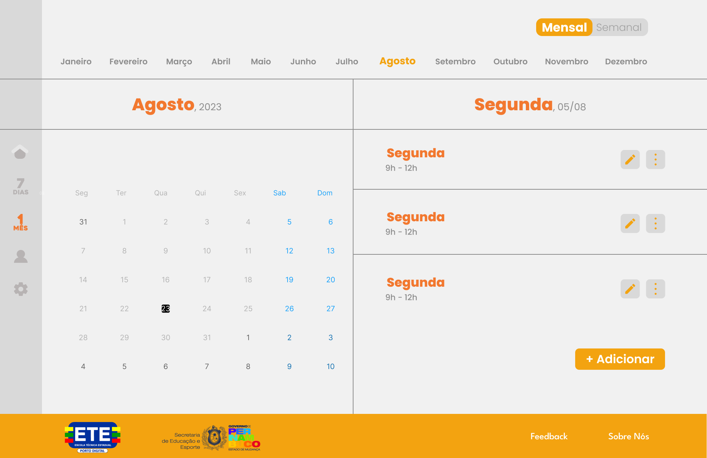
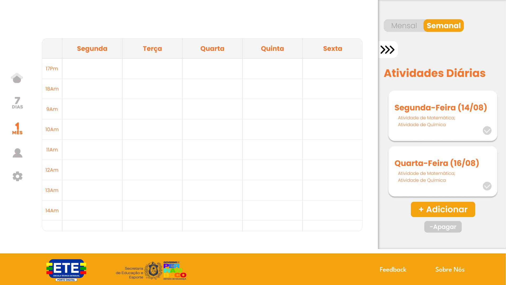
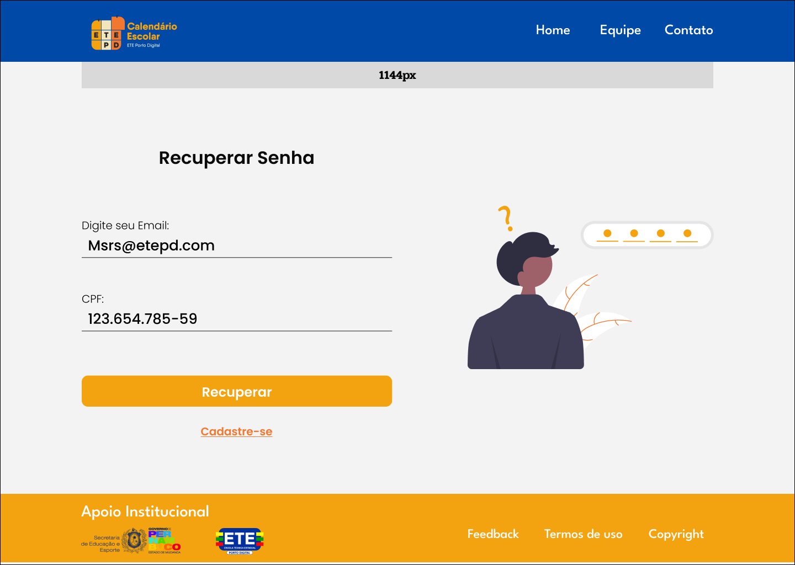
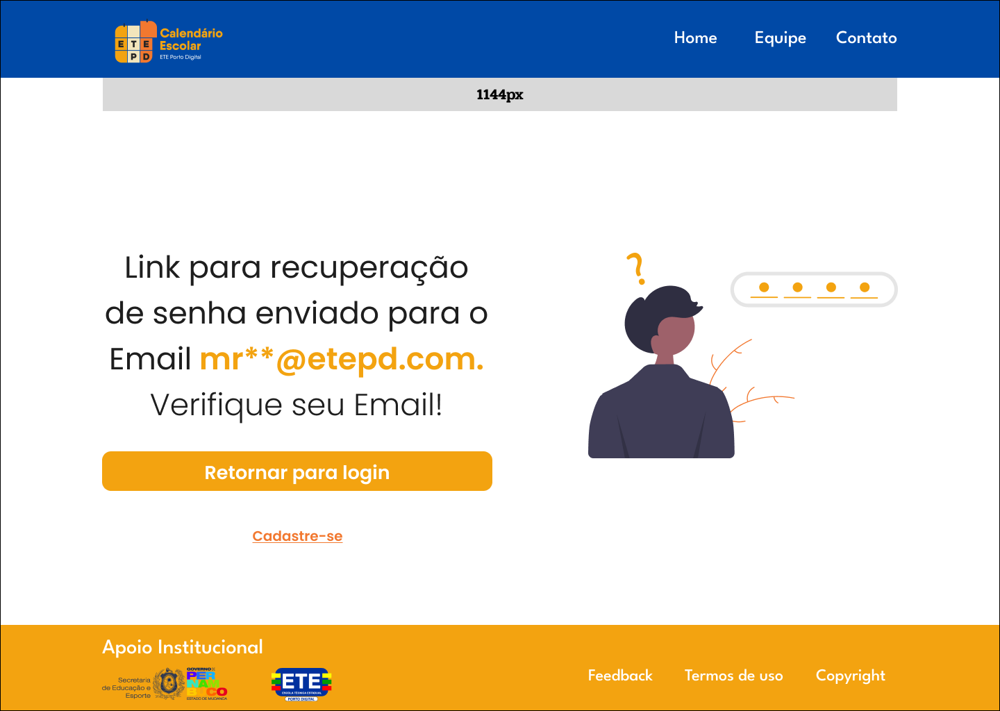

# Agenda Digital ETEPD 2023.2

Recriação do projeto de agenda digital desenvolvido durante a disciplina Projeto Integrador II. Alterações visam melhora na arquitetura do software, com otimização ou eventual remoção dos frameworks.
## Autora

[Ana Karina Caetano](https://github.com/AnaK-Caetano) ---- akcsm@discente.ifpe.edu.com / akcsm@etepd.com
## Screenshots

 \
 \
 \
 \
 \
 \
 \
 \
 
## Usado por

Esse projeto será usado pela Escola Técnica Estadual Porto Digital

## Documentação

[Documentação](https://link-da-documentação)

